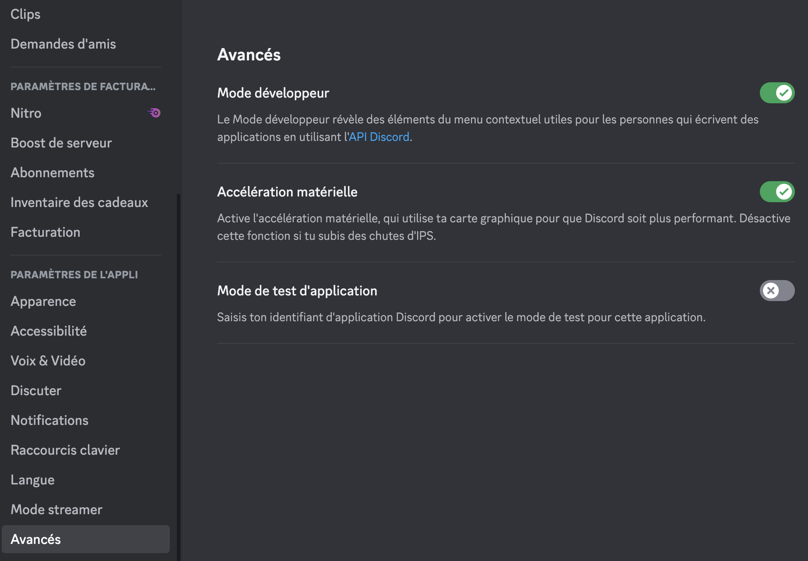
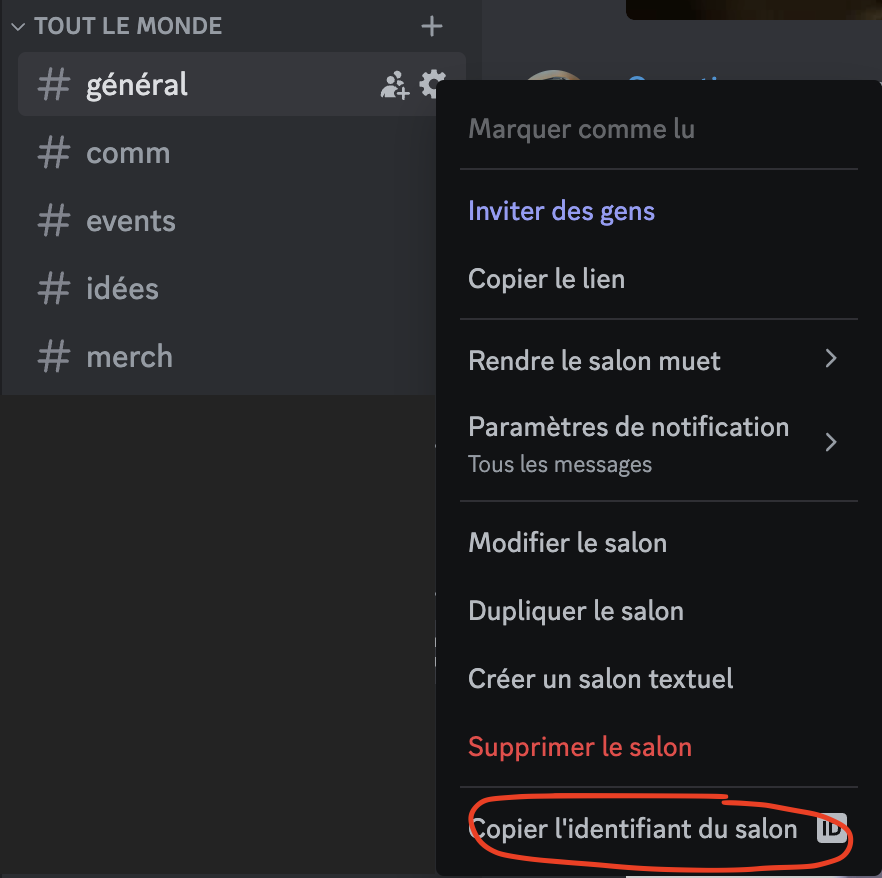
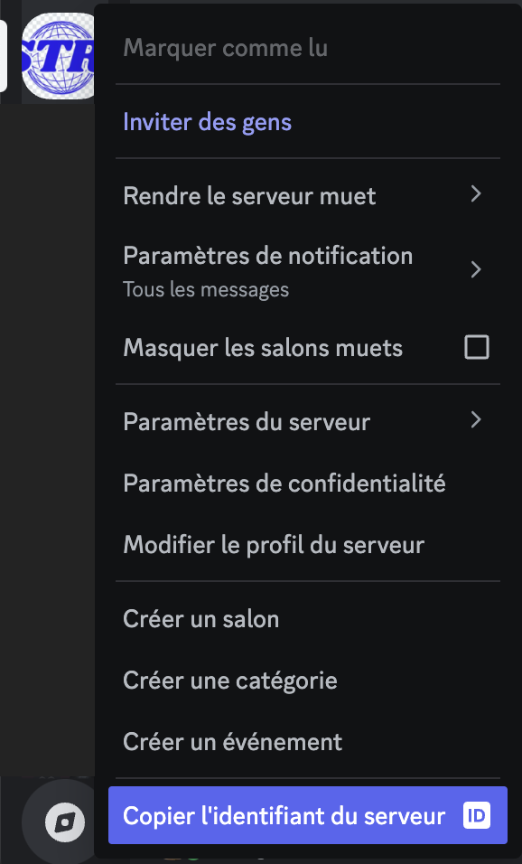
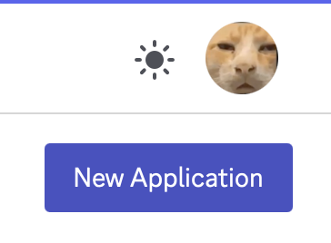
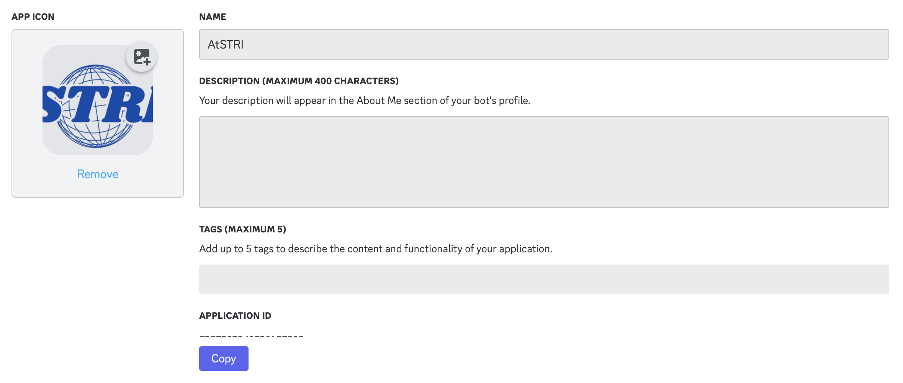
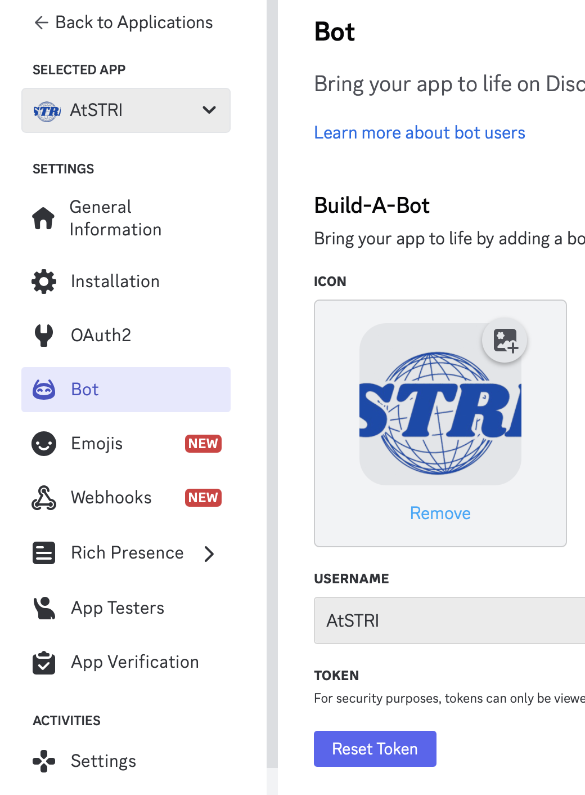
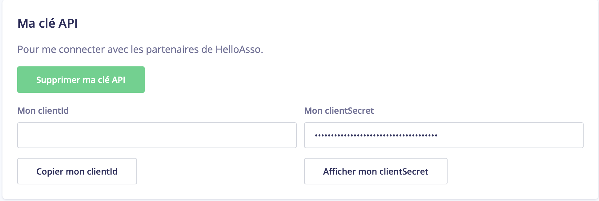
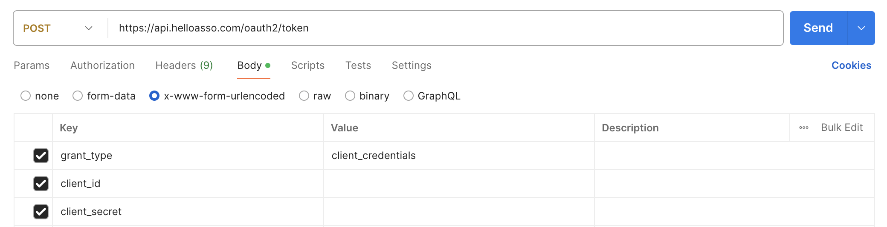

# BotAsso
This is the bot for the @STRI Association. This bot is designed to check the HelloAsso shop and ticket office.

## Summary
- [Description](#description)
- [Installation](#installation)
- [Configuration](#configuration)
- [Execution](#execution)
- [Commands/Events](#commands-events)
- [Issues](#issues)

## Description

This Discord bot was created to help manage and track the activities of the association's store through the HelloAsso API. Its primary goal is to provide a simple and accessible interface for real-time monitoring of sales made through the HelloAsso store. Here are its main features:

1. **Sales Tracking**:
   - Queries the HelloAsso API to retrieve data on orders placed through the store.
   - Allows visualization of information such as revenue generated, products sold, and sales trends.

2. **Graph Generation**:
   - Produces charts to visually represent sales data (bar charts for sold products, revenue trends, etc.).
   - Provides a clear and engaging summary of the store's performance.

3. **Automation and Accessibility**:
   - Simplifies access to sales data directly from Discord.
   - Eliminates the need to manually navigate HelloAsso to view statistics.

---

### Bot Benefits

- **Time-Saving**: By automating the collection and presentation of data, the bot allows managers to focus on other tasks.
- **Clarity and Transparency**: The generated charts and reports help better understand the store's performance.
- **Accessibility**: Information is available directly on a Discord server, making it easily accessible to multiple members.

---

If you'd like to expand or customize this description (e.g., including technical details or additional features), feel free to let me know!

## Installation
### On Ubuntu (or Debian)
1. Install NodeJS and npm
```bash
sudo apt-get install -y curl
curl -fsSL https://deb.nodesource.com/setup_23.x -o nodesource_setup.sh
sudo -E bash nodesource_setup.sh
sudo apt-get install -y nodejs
node -v
```
2. Clone the github repository
```bash
git clone https://github.com/Nexross13/BotAsso.git
```
3. Install NodeJS Modules
```bash
npm install
```

## Configuration
The `config.json` file is missing. This file contains sensitive data such as the bot token, the HelloAsso token, etc. **Never share this document!**

To set up the `config.json` file, please follow these steps:
1. Create the `config.json` file
```json
{
    "token": "",
    "guild": "",
    "client": "",
    "client_id_helloasso": "",
    "client_secret_helloasso": "",
    "client_token_helloasso": "",
    "salon_id": "",
    "refresh_token_helloasso": ""
}
```
- **token**: The Discord bot's client token.
- **guild**: The ID of the Discord server.
- **client**: The ID of the bot.
- **client_id_helloasso**: The HelloAsso account ID.
- **client_secret_helloasso**: The HelloAsso account secret.
- **client_token_helloasso**: The token of the HelloAsso account.
- **salon_id**: The ID of the Discord channel where you want the bot to send messages.
- **refresh_token_helloasso**: The refresh token of the HelloAsso account, used to renew the main HelloAsso token (**client_token_helloasso**).

2. Get all differents Discord's ID
    - First, you need to activate the developper mode on your Discord account

    - Then take the differents Discord' ID (right click on the channel or server):
    
    
3. Then, create your Discord bot and get what you need:
    - Go to https://discord.com/developers/applications
    - click on "New Application" and choose a good name
    
    - On the "General Information" page, you have the Application ID, this is your **client_id** on the `config.json`
    
    - Go to "Bot" page, then reset the token and copy the new in **token** 
    
5. To conclude, we are going to get IDs of HelloAsso:
    - Go to the page of your association and then click on "My Account" > "API and Integrations"
    - Générate your client id and copy them on your `config.json`
    
    - On Postman, fill in the various fields to make the request. The URL used is https://api.helloasso.com/oauth2/token
    
    When you click on "Send", you will receive a response like this:
    ```json
    {
        "access_token": "",
        "expires_in": 1800,
        "refresh_token": "",
        "token_type": "bearer"
    }
    ```
    Copy the **access_token** in **client_token_helloasso** and the **refresh_token** in **refresh_token_helloasso** in `config.json`.

## Execution
In your terminal, type the following command:
```bash
node index.js
```
And in antoher terminal, type the following command:
```bash
node deploy-command.js
```

The Bot will be starting !

## Commands/Events {#commands-events}
### Get Info of the Shop (Event)
#### **1. Retrieving Order Information**

The bot queries the HelloAsso API to fetch the latest data about orders. Here's how it handles the process:

1. **API Request**:
   - The bot sends an HTTP `GET` request to the HelloAsso API endpoint dedicated to retrieving shop payment data.
   - The URL might include parameters like `pageIndex` and `pageSize` to paginate the results.

2. **Headers**:
   - The request includes a `Bearer Token` in the `Authorization` header for authentication.

3. **Parsing the Response**:
   - The API responds with a JSON object containing the order data.
   - The bot parses this JSON to extract relevant details, such as:
     - `order.items`: The list of products in the order.
     - `order.amount`: The total amount for the order.
     - `order.date`: The date of the order.

---

#### **2. Identifying New Orders**

The bot compares the latest data fetched from the API with previously stored data to determine if there are new orders:

1. **Comparison**:
   - The bot maintains a record of the last processed orders (e.g., using their `order.id`).
   - It checks the new API results to find orders that are not in the previously stored list.

2. **Extracting New Orders**:
   - Any order that is present in the new data but not in the previously processed list is considered a "new order."

---

#### **3. Formatting the Output**

For any new orders identified, the bot formats the output into a structured message:

1. **Extracting Order Details**:
   - For each new order, the bot extracts:
     - The product name and quantity for each item in `order.items`.
     - Any additional information like delivery or custom options.

2. **Constructing the Message**:
   - The bot creates a message with a clear breakdown of the products and quantities in the order.
   - Example format:
     ```
     🛒 Nouvelle commande !
     Livraison : 1
     Hoodie Gris : 1
     Mugs logo STRI 2025 : 2
     Flammes "RFTM BEFORE ASKING" : 3
     Hoodie Rouge Bordeaux : 1
     Hoodie Noir : 1
     T-shirt Noir : 1
     T-shirt Blanc : 1
     ```

3. **Sending the Message**:
   - The bot sends the formatted message to a specified Discord channel using its `salon_id`.

### Get a graphe (Command)
#### **1. Purpose of the Feature**
- To visualize historical sales data from the HelloAsso store in a clear and concise way.
- The graph helps the team understand:
  - Daily revenue trends.
  - Overall growth via cumulative profits.

---

#### **2. How It Works**

##### **a. Data Preparation**
The bot retrieves sales data through an API query (`getEvolPrice`) and organizes it:
1. **Data Grouping**:
   - The data is grouped by date. For each date, the total revenue is calculated by summing up all orders for that day.
2. **Sorting**:
   - The dates are sorted in ascending order (from the earliest to the most recent) to ensure the graph reflects a logical timeline.
3. **Cumulative Calculation**:
   - A cumulative total is calculated for profits, showing how revenue grows over time.

---

##### **b. Graph Generation**
The bot uses the library `chartjs-node-canvas` to generate the graph:
1. **Graph Types**:
   - **Bar Chart**: Displays daily sales totals.
   - **Line Chart**: Displays cumulative profits over time as a smooth curve.
2. **Customization**:
   - The graph includes:
     - X-axis: Dates.
     - Y-axis: Amounts in euros.
     - Legends: Clearly label the bar chart and line graph.
     - Styling: Colors, borders, and labels for improved readability.
   - The graph is sized at 800x400 pixels.

---

##### **c. Returning the Graph**
The graph is generated as an image buffer using `renderToBuffer`, which creates an in-memory PNG file. This image is then sent to the Discord channel.

---

#### **3. Output**
When a user executes the bot's `/check-shop` command:
1. The bot:
   - Fetches sales data.
   - Processes it to calculate totals and cumulative profits.
   - Generates the graph.
2. The graph is sent as a message attachment.
3. The graph includes:
   - Daily sales bars.
   - A cumulative profit curve for trend analysis.

## Issues